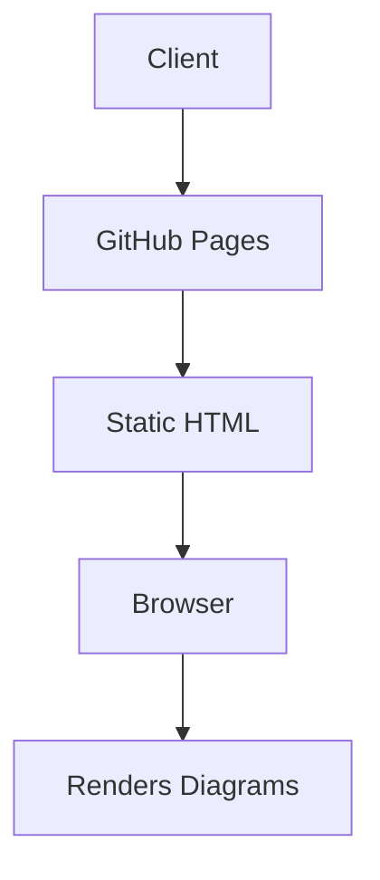

Here's a simple diagram showing a system architecture:

```mermaid
graph TD
    A[Client] --> B[GitHub Pages]
    B --> C[Static HTML]
    C --> D[Browser]
    D --> E[Renders Diagrams]
```

This is how your site works — all static, no server needed.
